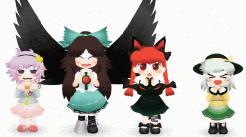

  
   
  
  
  
  
   
  
  

Hello!!! I am hawleh (and im not a girl, sorry people) 

## My projects:

|Project|Description|
|-|-|
|[Polytoria-CodeSnippets](https://github.com/hawleh/Polytoria-CodeSnippets)|Code snippets for Polytoria.|
|[all-limiteds](https://github.com/hawleh/all-limiteds)|A chart of who owns most limiteds in Polytoria.|
|[RBX2PT](https://github.com/hawleh/RBX2PT-web)|Turn your Roblox clothing to Polytoria clothing.|
|[hugo-oldbloxxer](https://github.com/hawleh/hugo-oldbloxxer)|A 2007 Roblox ahh looking hugo theme|
|[Polytoria Item Tracker](https://github.com/hawleh/polytoria-item-tracker)|A Discord bot to track down price changes of limiteds on Polytoria.|
|[Lunar Hill](https://github.com/lunar-hill)|An unsuccessful attempt to make a Roblox ripoff of a Roblox ripoff|
|[Talent Icons](https://github.com/hawleh/talent-icons)|Successor of the [Skill Icons](https://github.com/tandpfun/skill-icons) project. Show your talent with ease. Discontinued.|

## Programming languages:

## Frameworks and tools:

## Other things:

## Things that i am learning/want to learn/be able to use:

## My Stats:

  
  

